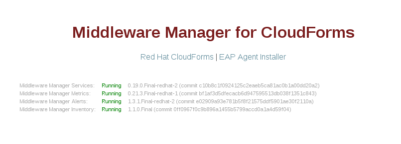
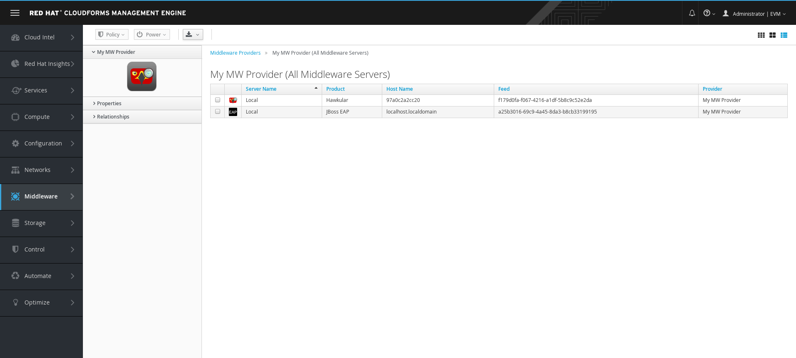

= Instrument an Enterprise Application Platform 7 server

== Download the agent installer

To instrument an Enterprise Application Platform (EAP) server and be able to monitor and manage it from CloudForms, you must install an agent on the EAP server.

The EAP agent installer is available for download from the middleware manager status page.  Launch a browser and navigate to `http://my_mwmanager_host:8080/`, click the "EAP Agent Installer" link then enter the credentials for the middleware manager user (the *HAWKULAR_USERNAME* and *HAWKULAR_PASSWORD*):

The middleware management server downloads a file name `hawkular-wildfly-agent-installer.jar` to your local machine.

== Install the Agent on the Enterprise Application Platform Server

After you have downloaded the .JAR file, use one of the following commands to copy the file to the EAP server (if it is on a different machine) and install the agent.  Select the command that matches the mode of your EAP server.

=== Standalone mode

[source, bash]
----
java -jar ~Downloads/hawkular-wildfly-agent-installer.jar
   --target-location=/opt/jboss-eap-7.0/
   --server-url=http://192.168.1.123:8080
   --username=my_mwmanager_username
   --password=my_mwmanager_password
----

=== Domain mode
[source, bash]
----
java -jar ~Downloads/hawkular-wildfly-agent-installer.jar
   --target-location=/opt/jboss-eap-7.0/
   --target-config=/opt/jboss-eap-7.0/domain/configuration/host.xml
   --server-url=http://192.168.1.123:8080
   --username=my_mwmanager_username
   --password=my_mwmanager_password
----

== Verify in CloudForms
Once installed, start or restart EAP, then access the Middleware Provider that was
already configured in CloudForms.

WARNING: The new WildFly server will not appear immediately

